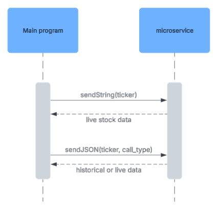

# microserviceA
CS361 - Microservice project

### Required external python modules 
pyzmq, yfinance, pandas

## REQUESTING DATA

server.py is able to accept TWO types of inputs: strings & JSON objects.

### String input
When sending a string, send the stock ticker symbol via the zeroMQ send_string function:

    stock = 'IBM'
    socket.send_string(stock)

### JSON input
When sending a JSON object, there MUST be TWO included properties, "**stock**" and "**call_type**":

 **stock** = stock ticker symbol

 **call_type** = [daily, weekly, monthly, live, all] (choose one)

    data = {'stock': 'IBM', 'call_type': 'monthly'}
    socket.send_json(data)

## RECEIVING DATA 

Both types of calls (string and JSON) will return a JSON object. 
    
    reply = socket.recv()
    reply_data = json.loads(reply.decode('utf-8'))

**_Note_**: the reply is technically a JSON **STRING** and must be loaded into a JSON **OBJECT**

Return data will be a JSON object with the format

    { 
        metadata: JSON object of metadata about the requested stock
        data: JSON object of requested data - will return [] if an error is present
        error: String, error message
    }
      

## SAMPLE REQUESTS
1. Run server.py

2. In a separate thread, run either string_example.py or json_example.py

**_sample_string.py_** will prompt you to enter a stock ticker symbol, and return 
data as if you passed a STRING to the microservice

**_sample_request.py_** will prompt you to enter a stock ticker symbol AND the type of data
you are looking for. It simulates sending a JSON object to the microservice